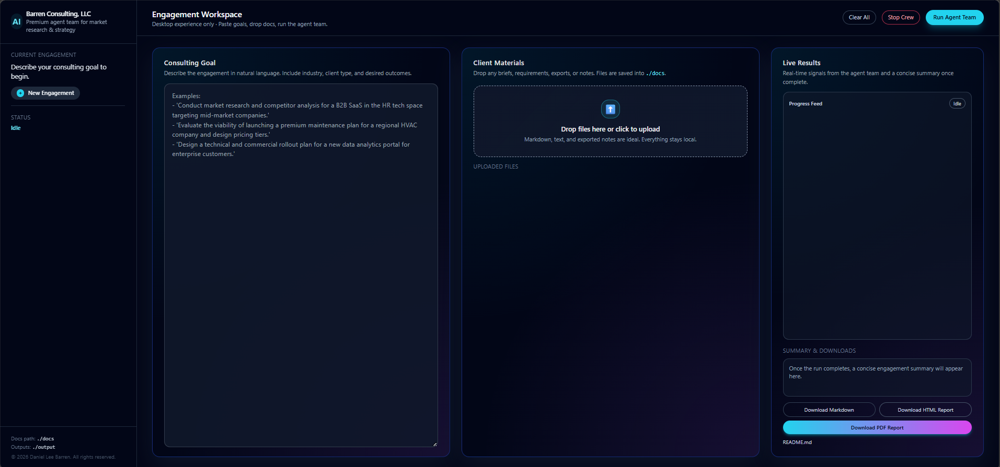
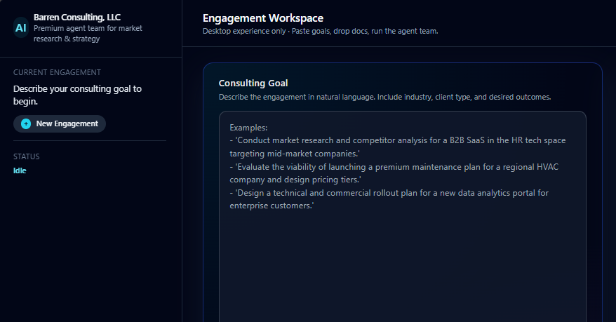
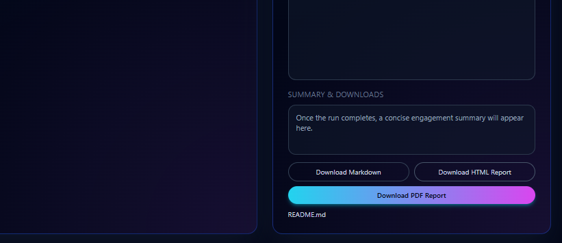
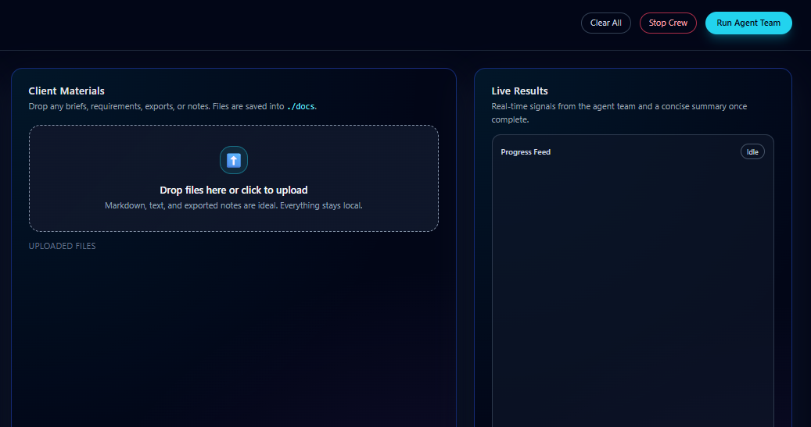

# AgenticAI Research Team – Your Personal AI Consulting Crew

I built this because I got tired of doing the same 6-hour research + competitor analysis + architecture write-up for every client.  

Now I drop a folder of docs, type what I need, hit one button, and get back a full consulting-grade deliverable in minutes — market research, competitor matrix, solution design, pricing strategy, and a client-ready package. All of it based **only** on the files I give it.

This is my actual daily driver. I use it for every new consulting gig.

### What It Actually Does
- Reads every file in your `./docs` folder (app descriptions, notes, requirements, exports, whatever) and treats it as the single source of truth.
- Researches the real market for whatever industry and client type you set.
- Finds actual competitors, builds a comparison table, and shows exactly where you can win.
- Designs a real solution architecture (especially strong for SaaS/web apps — it even writes code suggestions).
- Gives you 2–3 solid business model + pricing options with trade-offs.
- Packages everything into clean markdown reports + a beautiful PDF you can email to clients the same day.

I built a **Flask web UI** so you don’t even have to touch the terminal if you don’t want to. Drag and drop files, type your goal, watch live progress, then download the reports.










### Who This Is Actually For
- Solo consultants like me who want to look like a 5-person team
- Founders doing their own product research or go-to-market sprints
- Small agencies that need to crank out high-quality deliverables fast
- Anyone who has a pile of client docs and needs structured output instead of staring at a blank page

### How to Use It (The Way I Actually Use It)

1. Drop your client stuff in the `docs/` folder  
   (I usually put `app_description.md`, meeting notes, old requirements, screenshots as text, etc.)

2. Open the web UI (easiest way):
   ```bash
   cd web_ui
   python app.py
   ```
   Then go to http://localhost:8000

3. Drag and drop files → type what you want the crew to focus on → hit **Run Agent Team**

4. Watch it work in real time, then download:
   - The full markdown package
   - A clean professional PDF ready to send to the client

Or if you prefer the terminal:
```bash
crewai run
```

### Built-in Guardrails (Because I Hate Surprise Bills)
- Max 30 OpenAI calls per run
- Max $2 estimated cost before it pauses for approval
- 25-minute runtime cap
- Full logging so nothing goes off the rails
- Human approval gates before it writes final deliverables

### Tech Stuff (for the nerds)
- CrewAI + gpt-4o-mini (cheap & fast)
- Local ChromaDB (no cloud vector DB nonsense)
- WeasyPrint for beautiful PDFs
- Flask web UI with live progress streaming

I literally use this thing multiple times a week. It’s not some demo — it’s the tool that lets people run a one-man consulting business at a higher level.

Want to try it? Clone the repo, throw some docs in the `docs/` folder, and hit run.

Questions or want me to add something? Open an issue.

— Danny
